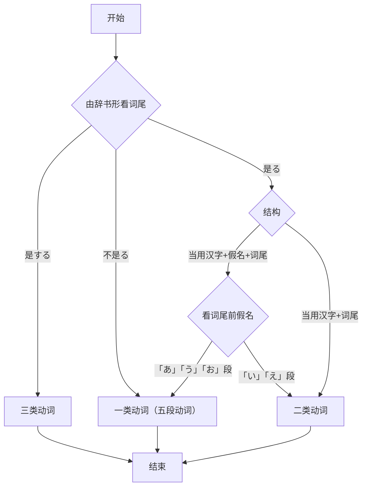

> 本文内容是 https://www.bilibili.com/video/BV1C54y1x7ap?p=15 的笔记

## 单词



|              |  | 今いま |      |      |
| -------------------- | ---------- | ----------- | -------------- | ------------------ |
| **おととい**         | 昨日**きのう** | 今日きょう  | 明日**あした** | 明後日**あさって** |
| 先々週せんせんしゅう | 先週       | 今週こんしゅう | 来週らいしゅう | 再来週さらいしゅう |
| 先々月せんせんげつ | 先月 | 今月こんげつ | 来月らいげつ | 再来月さらいげつ |
| **おととし** | 去年きょねん | 今年**ことし** | 来年らいねん | 再来年さらいねん |
| 今朝**けさ** | 午前ごぜん | 昼ひる | 午後ごご | 今晩こんばん、今夜こんや |

- お宅

  表示您家；御宅、オタク ，表示御宅族，热衷于某事儿的人群。

- 支社ししゃ

  本社ほんしゃ

- 頃ごろ

  表示时间点前后

| 一時           | 二時 | 三時       | 四時           | 五時   | 六時     | 七時         |
| -------------- | ---- | ---------- | -------------- | ------ | -------- | ------------ |
|                |      |            | よじ           |        |          | しちじ       |
| 八時           | 九時 | 十時       | 十一時         | 十二時 |          | 何時         |
|                | くじ |            |                |        |          | なんじ       |
| 一分           | 二分 | 三分       | 四分           | 五分   | 六分     | 七分         |
| いっぷん       |      | さんぶん   | よんぷん       |        | ろっぷん |              |
| 八分           | 九分 | 十分       | 十一分         |        |          | 十五分       |
| はっぷん       |      | じゅっぷん | じゅういっぷん |        |          | じゅうごふん |
| 三十分         |      | 半         | 何分           |        |          |              |
| さんじゅっぷん |      | はん       | なんぷん       |        |          |              |

总结：「1、6、8、10」数词量词都变了，数词变成了促音，量词变成半浊音；「3、4、何」有拨音，量词变成半浊音。

## 语法

### 体言和用言

- 体言：无活用——名词、代词、数词
- 用言：有活用——动词、形容词、形容动词

### 动词的特点

   - 由词干何和词尾组成
   - 词尾均在う段上，且有活用
   - 可独立构成谓语部分

### 动词的活用

记原形/辞书形/基本形，其他的可以推导

区分动词分类步骤：

### 动词特性总结

1. 一类动词（五段动词）
   1. 结尾是う段非る
       - 書（か）く
       - 探（さが）す
       - 勝（か）つ
       - 遊（あそ）び
       - 読（よ）む
       - ...
   2. 「あ」「う」「お」段＋る
       - 困（こま）る
       - 怒（おこ）る
       - 送（おく）る
       - 通（とお）る
       - 売（う）る
       - ...
   3. 特例
       - 切（き）る（い段）
       - 帰（かえ）る（え段）
       - 走（はし）る（い段）

2. 二类动词（一段动词）
   1. 汉字+る除了上面的特例都是二类动词
   2. い段＋る（上一段动词）
      - 起（お）きる
      - 着（き）る：穿
      - 似（に）る
      - 居（い）る
      - 見（み）る：看
      - ...
   3. え段＋る（下一段动词）
      - 食（た）べる
      - 見（み）える：能看得见
      - 教（おし）える
      - 受（う）ける
      - 寝（ね）る
      - 出（で）る
      ...
    > Q：何理解上一段、上一段？
    >
    > A：以う为中界，上一个假名是い，下一个假名是え，所以い段＋る是上一段动词，え段＋る是下一段动词。
    >
    > Q：如何理解五段动词？
    >
    > A：五段动词在变形时，不同的形式分别对应あいうえお五段。

3. 三类动词
   1. カ变动词

      来（く）る

   2. サ变动词

      する：做、干、搞、打、决定、变化

### 动词的连用形

- カ变动词：来（く）る → 来（き）
- サ变动词：する → し
- 一段动词：去掉词尾的る
- 五段动词：词尾「う段」假名变成同行「い段」假名

连用形（部分）可以充当名词使用、接ます构成礼貌体。

### 动词的ます形（礼貌体）

- 连用形+ます
- 动词的ます形有时态的表达能力

| 分类 | 原型     | ます肯定   | ません否定   | ました过去时 | ませんでした过去否定时 |
| ---- | -------- | ---------- | ------------ | ------------ | ---------------------- |
| 一类 | ある     | あります   | ありません   | ありました   | ありませんでした       |
|      | 休む     | 休みます   | 休みません   | 休みました   | 休みませんでした       |
|      | 終わる   | 終わります | 終わりません | 終わりました | 終わりませんでした     |
| 二类 | いる     | います     | いません     | いました     | いませんでした         |
|      | 寝る     | 寝ます     | 寝ません     | 寝ました     | 寝ませんでした         |
| 三类 | 勉強する | 勉強します | 勉強しません | 勉強しました | 勉強しませんでした     |
|      | 来る     | 来ます     | 来ません     | 来ました     | 来ませんでした         |

### 动作发生的时间

- 时间点
  1. 当时间为包含数字的具体、绝对的时间时，需要在时间后加に
      - 学校は**八時に**始まります。
      - 昨日李さんは**十一時に**寝ました。
  2. 当时间为相对的时间时，时间后面不能加に
      - 今　最近（さいきん）　昨日　今週　来月　毎年（まいねん）。。。
      - 森さんは今日休みます。
      - 田中さんは明日働きます。
      - 森さんは先週休みました。
  3. 时间后面可加可不加に
      - 曜日　春　夏　秋　冬　午前　午後　朝　夜　春休み。。。
- 时间段
  体时间ら　体时间で　动词
  - 私は月曜日から金曜日まで勉強します。
  1. 当主体动作为瞬间动作时，不可以用から／まで。
    - <del>食堂は一時まで終わります。</del>Ⅹ
    - 食堂は一時に終わります。O
  2. から／まで可以一起用，也可以分开用
    - 私は朝１０時まで寝ました。
    - 授業は８時から始まります。

  > 「終わる」是瞬间动词，不可以配合「まで」，但是「始まる」可以配合「から」。与中文的表达不一样。

  3. 在句意表达完整的情况下，から／まで可以直接接です
    - 授業は８時からです。
    - 食堂は１時までです。

- 询问时间
  いつ：大概或具体的时间
  何時　何曜日：具体的时间
  - 夏休みはいつですか。
  - 森さんはいつ旅行しますか。
  - 会議は何時ですか。
  - 仕事は何時に終わりますか。

### 对比

Aは…が、Bは…

## 课文


